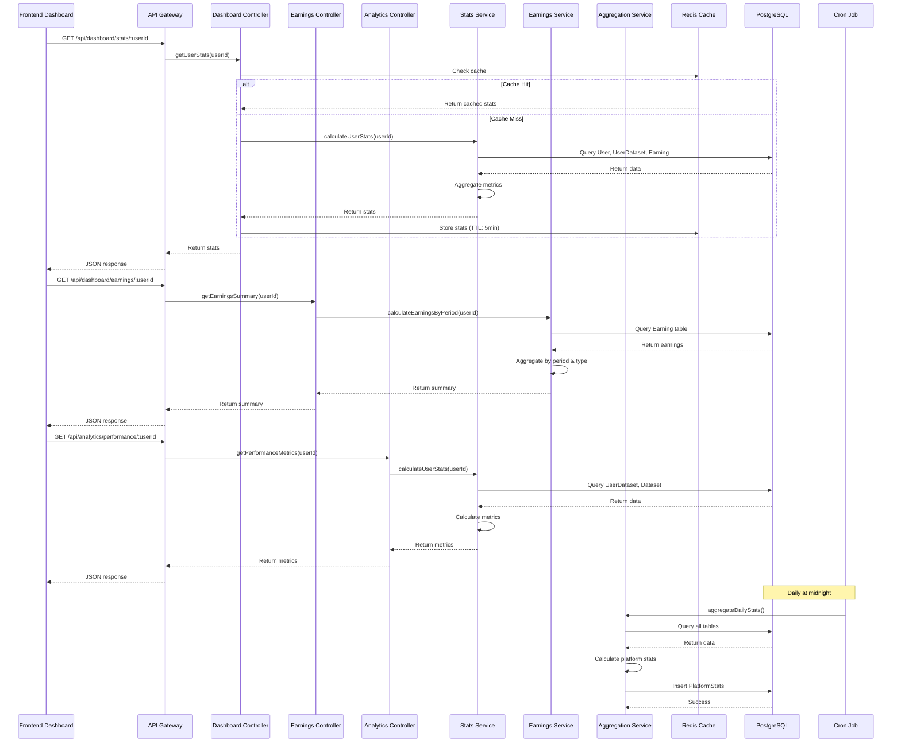

# Dashboard API

This document describes the Dashboard API endpoints (dashboard + earnings + analytics).
All endpoints are mounted under `/api/dashboard` and `/api/analytics`.

Default base URL: `https://<your-backend-host>/api`

Rate limiting: By default the server applies a rate limiter to `/api/*`:

- window: 15 minutes (900000 ms)
- max: 100 requests
  (Controlled by `RATE_LIMIT_WINDOW_MS` and `RATE_LIMIT_MAX_REQUESTS` environment variables.)

Authentication: All endpoints marked as **Authentication: Required** expect a valid JWT in the `Authorization: Bearer <token>` header.

---

## GET /api/dashboard/stats/:userId

Returns user statistics for dashboard overview.
**Authentication:** Required (Bearer token)

**Parameters:**

- `userId` (path, string, required) - User ID

**Response:**

```json
{
  "data": {
    "userId": "62f1c8bc-b65b-4380-ad4e-71d46183d717",
    "totalEarnings": 14547,
    "monthlyEarnings": 3420,
    "weeklyEarnings": 856,
    "publishedDatasets": 7,
    "rankingPosition": 124,
    "downloads": 1234,
    "reputation": 89
  },
  "cached": false
}
```

**Error Responses:**

- 400 Bad Request - Missing `userId`
- 401 Unauthorized - Missing or invalid token
- 403 Forbidden - User can only access own stats (unless admin)
- 404 Not Found - User not found
- 500 Internal Server Error

---

## GET /api/dashboard/datasets/:userId

List user's datasets (including UserDataset metadata).
**Authentication:** Required (Bearer token)

**Parameters:**

- `userId` (path, string, required)
- query: `limit`, `offset` (optional)

**Response:**

```json
{
  "data": [
    {
      "userDataset": { "id": "...", "status": "bonding", "publishedAt": "..." },
      "dataset": { "id": "...", "title": "...", "price": 9.99 },
      "earnings": 123.45,
      "downloads": 12,
      "holders": 5,
      "qualityScore": 82
    }
  ]
}
```

**Errors:** 400, 401, 403, 500

---

## GET /api/dashboard/datasets/:userId/:datasetId

Get dataset details and user-dataset relationship.
**Authentication:** Required

**Parameters:**

- `userId` (path, string, optional) — used to fetch `userDataset` if present
- `datasetId` (path, string, required)

**Response:**

```json
{
  "data": {
    "dataset": {"id":"...","title":"...","creator":{...}},
    "userDataset": {"id":"...","status":"bonding"},
    "earnings": 12.5,
    "downloads": 3
  }
}
```

**Errors:** 400, 404, 401

---

## POST /api/dashboard/datasets/publish

Publish or upsert a `UserDataset` (mark dataset as published/bonding).
**Authentication:** Required

**Body:** (application/json)

- `userId` (string, required)
- `datasetId` (string, required)
- `deploymentType` (string, optional) - e.g. `public` / `private`
- `storageProvider` (string, optional)

**Response:**

```json
{
  "data": {
    "id": "88fbbea2-dd5f-47b4-8078-bfe99aa4a0c5",
    "userId": "...",
    "datasetId": "...",
    "status": "bonding",
    "publishedAt": "2025-12-12T05:35:25.369Z"
  }
}
```

**Notes:** This endpoint will also:

- update `Dataset.status` to `active`
- create an `ActivityLog` entry `dataset_published`
- invalidate dashboard cache for the user

**Errors:** 400, 401, 403, 500

---

## PUT /api/dashboard/datasets/:datasetId

Update dataset metadata (title, description, price, status).
**Authentication:** Required

**Parameters:**

- `datasetId` (path, string, required)

**Body:** any of

- `title`, `description`, `price`, `status`

**Response:**

```json
{
  "data": {
    /* updated dataset object */
  }
}
```

**Errors:** 400, 401, 403, 404, 500

---

## DELETE /api/dashboard/datasets/:datasetId

Soft-delete (archive) a dataset by setting `status` to `archived`.
**Authentication:** Required

**Parameters:**

- `datasetId` (path, string, required)

**Response:**

```json
{
  "data": {
    /* updated dataset object with status=archived */
  }
}
```

**Errors:** 400, 401, 403, 404, 500

---

## GET /api/dashboard/activity/:userId

Get a user's activity feed (activity_log entries).
**Authentication:** Required

**Parameters:**

- `userId` (path, string, required)
- `limit` (query, integer, optional)

**Response:**

```json
{ "data": [ {"action":"dataset_published","details":{...},"createdAt":"..."} ] }
```

**Errors:** 400, 401, 403, 500

---

# Earnings endpoints (mounted under `/api/dashboard/earnings`)

## GET /api/dashboard/earnings/:userId

Get earnings summary for a user (totals, period breakdown).
**Authentication:** Required

**Response:**

```json
{
  "data": {
    "total": 12345.67,
    "byPeriod": {
      "last7Days": 123.4,
      "last30Days": 987.6
    },
    "byType": [
      { "type": "download", "total": 1000 },
      { "type": "trading_fee", "total": 200 }
    ]
  }
}
```

**Errors:** 400, 401, 403, 500

---

## GET /api/dashboard/earnings/:userId/by-dataset

List earnings broken down by dataset for a user.
**Authentication:** Required

**Response:**

```json
{ "data": [{ "datasetId": "...", "total": 123.45 }] }
```

---

## GET /api/dashboard/earnings/:userId/by-type

Earnings aggregated by type for a user.
**Response:**

```json
{
  "data": [
    { "type": "download", "total": 1000 },
    { "type": "trading_fee", "total": 200 }
  ]
}
```

---

## GET /api/dashboard/earnings/:userId/timeseries

Return timeseries of earnings for a user (daily buckets by default).
**Query params:** `from` (ISO date), `to` (ISO date), `interval` (daily/weekly)

**Response:**

```json
{
  "data": [
    { "date": "2025-11-01", "total": 12.5 },
    { "date": "2025-11-02", "total": 0 }
  ]
}
```

---

# Analytics endpoints (`/api/analytics`)

## GET /api/analytics/performance/:userId

Returns aggregated performance metrics for a user.
**Authentication:** Required

**Response:**

```json
{
  "data": {
    "totalRevenue": 12345.67,
    "activeCount": 3,
    "graduatedCount": 1,
    "avgQuality": 82.3
  }
}
```

---

## GET /api/analytics/comparison/:userId

Return top datasets and performance index for comparison.
**Authentication:** Required

**Response:**

```json
{
  "data": [{ "datasetId": "...", "performanceIndex": 85.2, "earnings": 123.4 }]
}
```

---

## GET /api/analytics/categories/:userId

Category distribution of user's datasets with earnings.
**Authentication:** Required

**Response:**

```json
{ "data": [{ "category": "finance", "datasetCount": 3, "earnings": 1200 }] }
```

---

## GET /api/analytics/engagement/:userId

User engagement metrics (downloads per dataset, holder growth, trading volume trend).
**Authentication:** Required

**Response:**

```json
{
  "data": {
    "avgDownloadsPerDataset": 12.4,
    "holderGrowthRate": 0.05,
    "tradingVolumeTrend": [{ "date": "2025-12-01", "total": 10 }]
  }
}
```

---

## GET /api/analytics/platform

Public platform stats (latest aggregated snapshot).
**Authentication:** Optional (public)

**Response:**

```json
{
  "data": {
    "totalUsers": 1200,
    "totalDatasets": 340,
    "totalVolume": 12345.67,
    "totalEarnings": 98765.43
  }
}
```

---

## GET /api/analytics/export/:userId

Export analytics for a user in CSV/JSON format.
**Authentication:** Required

**Query:** `format=json|csv` (default: json)

**Response:** File download or JSON payload depending on `format`.

---

# Errors and common responses

All endpoints follow a JSON error schema:

```json
{ "error": "Description of the error" }
```

When `NODE_ENV === 'test'`, the error response may include a `stack` field to aid debugging.

Common error statuses:

- 400 Bad Request - invalid or missing parameters
- 401 Unauthorized - missing or invalid JWT
- 403 Forbidden - user access violation
- 404 Not Found - resource not found
- 429 Too Many Requests - rate limit exceeded
- 500 Internal Server Error - unexpected server error

---

# Rate limits

The service applies a global rate limit to `/api/*` by default:

- Window: `RATE_LIMIT_WINDOW_MS` (default 900000 ms = 15 minutes)
- Max: `RATE_LIMIT_MAX_REQUESTS` (default 100)

Set these via environment variables in production to match your usage profile.

---

# Caching

The dashboard uses Redis caching for several computed endpoints. TTLs (default values):

- `DASHBOARD_CACHE_TTL` (user stats): 300 seconds
- `EARNINGS_CACHE_TTL`: 600 seconds
- `ANALYTICS_CACHE_TTL`: 900 seconds
- `PLATFORM_STATS_CACHE_TTL`: 3600 seconds

Cache is invalidated by write operations such as publishing datasets and recording earnings.

---

# Authentication

All protected endpoints require an Authorization header:

```
Authorization: Bearer <JWT>
```

The middleware validates the JWT and sets `req.user` with `id` and `isAdmin`.

---

# Deployment Checklist

Before deploying:

1. Run Prisma migrations: `npx prisma migrate deploy` (or `prisma db push` for no-migration workflows)
2. Generate Prisma client (build step): `npx prisma generate`
3. Seed dashboard data (optional for initial run): `npx ts-node prisma/seed-dashboard.ts`
4. Verify Redis connection for caching
5. Verify Elasticsearch indices are reachable
6. Test all endpoints with Postman/curl
7. Check cron job (daily aggregation) is scheduled and running
8. Monitor logs for errors
9. Set up monitoring/alerting for dashboard endpoints (response time, error rate)
10. Update frontend environment variables with backend URL

---

## Architecture Diagram



---

# Summary

This service provides a complete Dashboard set of endpoints (stats, datasets, activity, earnings, analytics). It uses Prisma + Postgres for persistence, Redis for caching, Elasticsearch for search/marketplace sync, and a daily cron-based aggregation to populate `PlatformStats` snapshots. The API enforces authentication and follows a per-route rate limiting policy. For testing, use Docker Compose in the repository root to start dependencies (Postgres, Redis, MinIO, Elasticsearch) and run tests inside the `backend` container.

Example quick curl (get stats):

```bash
curl -H "Authorization: Bearer $TOKEN" \
  https://api.example.com/api/dashboard/stats/<USER_ID>
```
